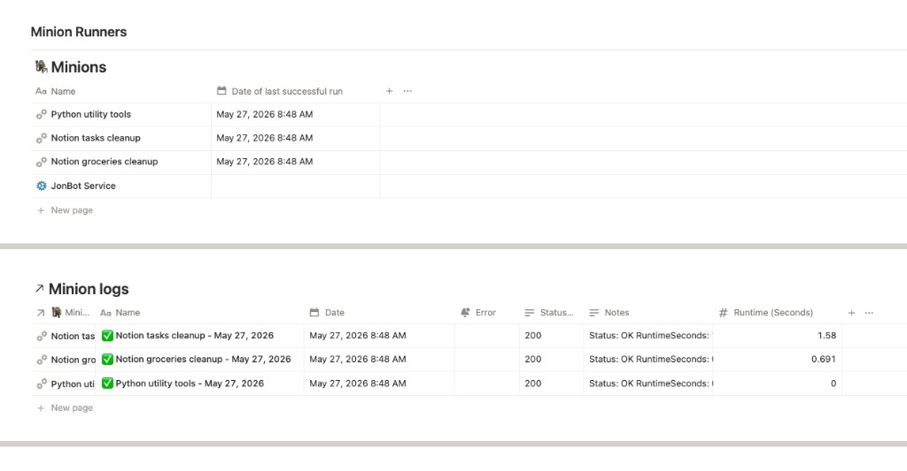
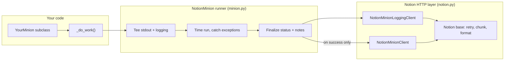

# notion-minions

A Python toolkit for the Notion REST API plus a tiny "minion" framework for self-logging scheduled jobs.



## Why

Two pain points this solves:

1. **Notion's REST API has retry, chunking, and template/data-source gotchas** that you end up re-implementing every project. The `Notion` base class handles them once.
2. **Recurring background jobs (cron / launchd) usually log to a file nobody reads.** `NotionMinion` makes every run write its own log page in Notion -- status, runtime, full stdout -- automatically.

## Features

- **Notion API v2026-03-11 client** with bounded retries, `Retry-After` honoring, and explicit `(connect, read)` timeouts.
- **Rich-text auto-chunking** (<=1900 chars/item, <=100 items, with truncation notice).
- **Property formatters**: TITLE, TEXT, DATE, SELECT, NUMBER, RELATION, ICONS.
- **Data-source query** with auto-pagination.
- **Batch page archiving** with per-request and per-batch pacing.
- **Templated page creation** (`data_source_id` + `template_id` flow).
- **`NotionMinion` base class**:
  - Tees stdout + logging into a buffer.
  - Times the run, catches exceptions, marks status.
  - Writes a templated log page with a `LOGS` code block.
  - Updates "Date of last successful run" on success only.
  - Adds an error callout block when `[ERROR]` lines are present.

## Quickstart

1. **Create a Notion integration** at <https://www.notion.so/my-integrations> and copy the token.

2. **Create two Notion databases** with the schemas described in [Required Notion schema](#required-notion-schema) below. Share both databases with your integration.

3. **Copy the example config and fill in your database IDs:**

   ```bash
   cp notion_minions/config/notion_config.example.json \
      notion_minions/config/notion_config.json
   ```

   Edit `notion_config.json` and replace the placeholder IDs with your own.

4. **Copy the env file and set your token:**

   ```bash
   cp .env.example .env
   ```

   Edit `.env` and paste your integration token.

5. **Install dependencies:**

   ```bash
   pip install -r requirements.txt
   ```

6. **Run the hello example:**

   ```bash
   python -m examples.hello_minion
   ```

   Check your Minion logs database in Notion -- you should see a new log page.

## Required Notion schema

### "Minions" database

| Property | Type |
|---|---|
| Name | title |
| Date of last successful run | date |

Each row represents one minion service. The `minions` block in `notion_config.json` maps a service key to the Notion page ID of its row.

### "Minion logs" database (with template)

| Property | Type |
|---|---|
| Name | title |
| Minion Service | relation -> Minions DB |
| Date | date |
| StatusCode | rich_text |
| Runtime (Seconds) | number |
| Notes | rich_text |
| Error | select (option: "ERROR") |

Create a **template** in this database (Notion menu -> "New template"). The template body should be empty -- `populate_log_codeblock` writes the `LOGS` heading and code block itself. Note the `data_source_id` and `template_id` from the Notion API and add them to your config.

## Writing your own minion

```python
from notion_minions import NotionMinion

class HelloMinion(NotionMinion):
    def __init__(self):
        super().__init__(
            service_key="hello_minion",
            service_display_name="Hello Minion",
        )

    def _do_work(self) -> None:
        print("Hello from a self-logging minion!")
        self._append_run_note("Said hello.")

if __name__ == "__main__":
    HelloMinion().run()
```

`service_key` must match a key in the `minions` block of your `notion_config.json`. Everything else is handled by the base class: stdout capture, timing, exception handling, log page creation, and last-success-date updates.

See `examples/cleanup_minion.py` for a more complete example that queries a data source for done items and batch-archives them.

### Useful methods in `_do_work()`

| Method | Purpose |
|---|---|
| `self._append_run_note(msg)` | Add a line to the Notes property (truncated at 800 chars). |
| `self._logger` | Standard `logging.Logger`; output is captured into the LOGS block. |
| `print(...)` | Also captured (stdout is teed into the log buffer). |
| `self._run_had_errors = True` | Mark the run as failed (sets icon, Error select, skips last-success update). |
| `self._status_code = 500` | Override the default 200 status code written to the log. |

## Architecture



**`notion.py`** -- `Notion` (base HTTP client + formatters), `NotionMinionClient`, `NotionMinionLoggingClient`. Two-tier error handling: business-logic methods raise on non-200, logging-infrastructure methods log and return.

**`minion.py`** -- `NotionMinion` lifecycle: tee stdout, attach log handler, run `_do_work()`, finalize, write Notion log, update last-success date.

## License

MIT -- see [LICENSE](LICENSE).
